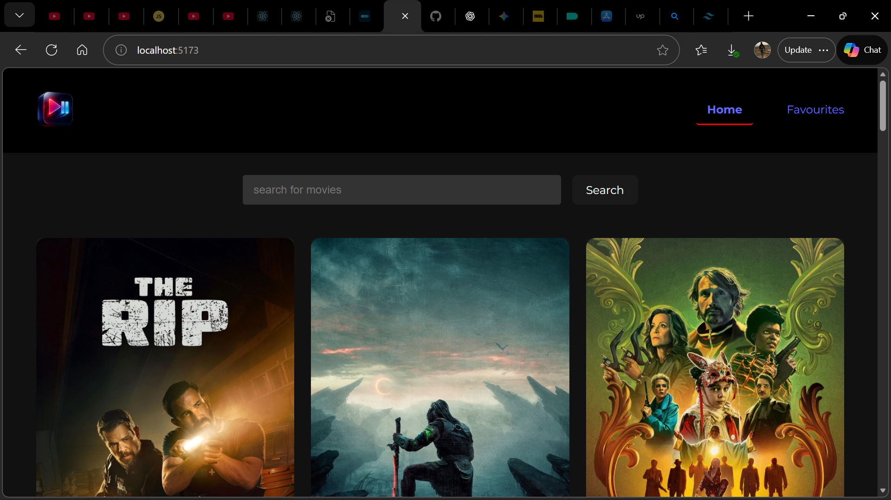
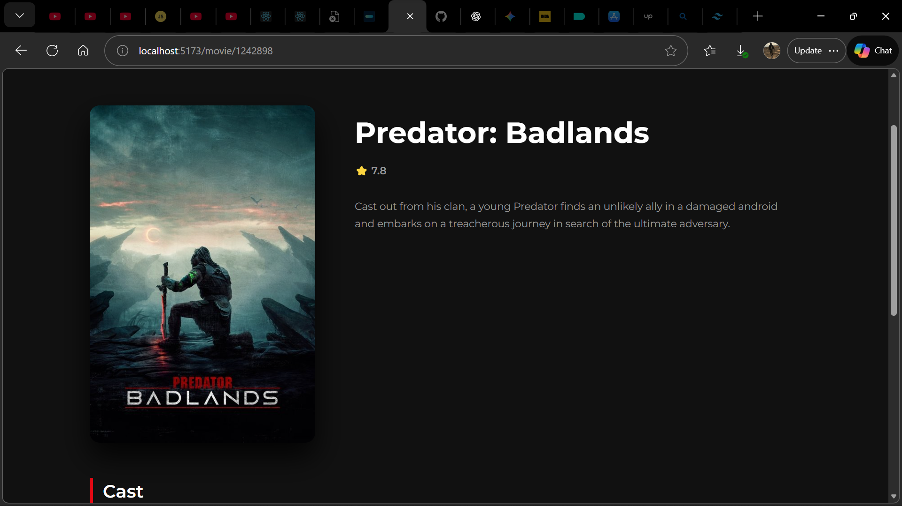
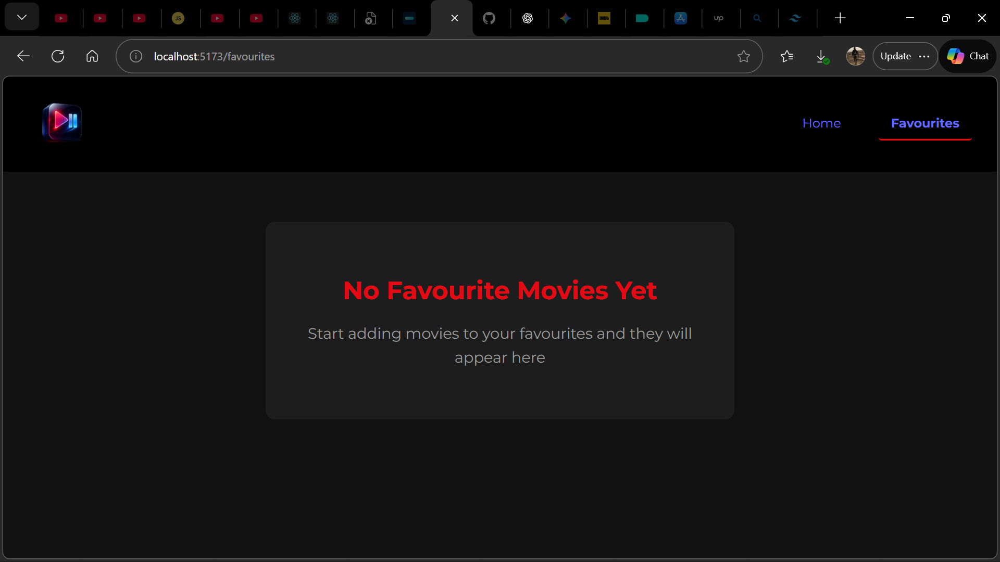

# Movie App

A modern, responsive movie web application built with React that allows users to browse movies, view details, and manage favourites using persistent storage.

## Preview

## Features

- Browse trending and popular movies
- View detailed movie information (rating, overview, cast, providers)
- Add and remove movies from favourites
- Persistent favourites using localStorage
- Fully responsive layout for mobile, tablet, and desktop
- Clean and accessible UI

## Tech Stack

- React
- React Router
- Context API
- JavaScript (ES6+)
- CSS Grid & Flexbox
- TMDB API

## Technical Highlights

- Global state management using React Context API
- Dynamic routing for movie details pages
- Responsive layout using CSS Grid and Flexbox
- Local storage synchronization for persistent user data
- Component-based architecture for scalability

## Environment Variables

Create a `.env` file in the project root:

VITE_TMDB_API_KEY=your_api_key_here

## Installation

1. Clone the repository:
   git clone https://github.com/OkitiAchim/movie-app.git

2. Install dependencies:
   npm install

3. Start the development server:
   npm run dev

## Future Improvements

- User authentication
- Watchlist and ratings
- Improved accessibility
- Backend integration

## Author

Vwegba Okiti  
GitHub: https://github.com/OkitiAchim

